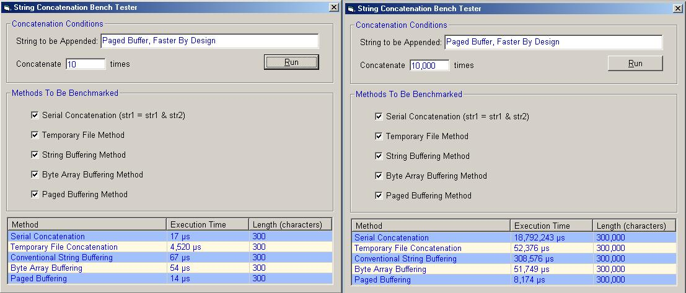



## Fastest String Concatenation Yet In Visual Basic

### Description

This is the fastest string concatenation method you'll ever come across in Visual Basic. I use a novel buffering technique that leaves the competition choking on my dust.
 
### More Info
 

             |
---                |---
**Submitted On**   |2002-07-21 23:56:32
**By**             |[Chris\_Lucas ](https://github.com/Planet-Source-Code/PSCIndex/blob/master/ByAuthor/chris-lucas.md)
**Level**          |Intermediate
**User Rating**    |5.0 (150 globes from 30 users)
**Compatibility**  |VB 4\.0 \(32\-bit\), VB 5\.0, VB 6\.0, VB Script, ASP \(Active Server Pages\) , VBA MS Access, VBA MS Excel
**Category**       |[String Manipulation](https://github.com/Planet-Source-Code/PSCIndex/blob/master/ByCategory/string-manipulation__1-5.md)
**World**          |[Visual Basic](https://github.com/Planet-Source-Code/PSCIndex/blob/master/ByWorld/visual-basic.md)
**Archive File**   |[Fastest\_St1090707222002\.zip](https://github.com/Planet-Source-Code/chris-lucas-fastest-string-concatenation-yet-in-visual-basic__1-37141/archive/master.zip)

### Source Code

<u>Features</u>

<UL>

<LI>Faster than anything else (check out screenshot!)</LI>
<LI>No API calls</LI>
<LI>Fully configurable at runtime</LI>
</UL>
 

<u>Method</u>

    The buffering scheme I've come up with is simplicity itself.  Rather than allocating
increasingly large buffers only to move the previous buffer into the new buffer I've taken a different approach.  
My buffer is a string array.  When one string fills up the class simply moves on to the next string in the array.  
While this seems like a minor change it has two very profound effects on string concatenation.  First, this approach speeds
concatenation up dramatically.  This is because buffers are never moved around which obviously takes time.  Second, much
larger strings are possible because unlike conventional buffering schemes paged buffering does not require one huge and continuous
chunk of memory.

 

<u>Implementation</u>

    Paged buffering string concatenation is best implemented as a class module.  I've named this class
cFastCat
and implemented it as follows:

Read / Write Properties

<UL>
<LI>BufferPages - Sets/returns the number of pages contained in the buffer</LI>
<LI>BufferPageSize - Sets/returns the size of each buffer page</LI>
</UL>

Read Only Properties

<UL>
<LI>Value - Returns the current string in the buffer.  This is the default property of cFastCat</LI>
<LI>TotalBufferSize - Returns the amount of space in bytes the buffer is currently using.  Because the buffer does not
by default free its resources this space can be different from the size of the string in the buffer</LI>
<LI>StringLength - Returns the length in characters of the string in the buffer</LI>
<LI>StringLengthB - Returns the length in bytes of the string in the buffer</LI>
</UL>

Methods

<UL>
<LI>Append - Concatenates the passed string onto the end of the buffer</LI>
<LI>Flush - Empties the buffer</LI>
<LI>ReleaseMemory - Frees all currently consumed resources</LI>
</UL>

 

<u>Don't Take My Word For it</u>

    I've included everything in the zip.  A demonstration project is included as well as a full article complete
with graphs of the timing results for a variety of calls.  Nothing is faster and all the proof is free for the downloading. Please
leave your votes and feedback.

 

